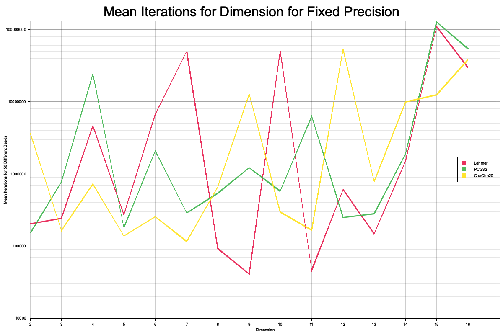

# `lehmer-rs`
A project around Lehmer RNGs.
See the subsections for some example applications, statistical tests and breakage.

*To build the project testu01 is required since we dynamicly create rust bindings for it.*

Install testu01 via your package manager or compile it yourself.
See: <https://simul.iro.umontreal.ca/testu01/tu01.html>
```sh
sudo apt install libtestu01-0-dev -y
sudo pacman -S testu01
```

## Benchmarks
There are benchmarks to compare the performance of the different parameter sets.
`cargo bench` invokes criterion benchmarks of a fixed iteration count and a monte carlo approximation for all parameter sets.

## Statistical Tests

### Crush it
The crushes are a collection of common statistical tests for PRNGs.
```sh
cargo run --release -- [small-crush|crush|big-crush]
```

Depending on the generator:
- SmallCrush takes a couple of seconds
- MediumCrush takes around 20-40 minutes
- BigCrush takes a couple of hours

Since the API design of testu01 is quite restrictive, you have to edit the sourcecode for different permutations.
Notably reversing the bit order of the RNG output might be interesting as well as truncating the expected output of the generator for testu01.
Note: truncating results in the least significant bits being cut off, not the other way around, so it seems to be only useful in combination with bit reversal.

#### Interpreting the results
For the generators with a modulos close to 2^32 or even bigger, most testcases fail due to the nature of Lehmer RNGs having no duplicate elements within their period. Lemire doesn't have this issue for this value range, and it is the only RNG in this repository, which passes BigCrush.

The generators with a modulos small than 2^31 would need some form of bit widdening algorithm to compensate for the state being a lot smaller than a full u32.

- BirthdaySpacings: due to the birthday problem we would expect a lot of duplicates
- CollisionOver: overlapping variant of counting collisions
- Permutation: order n non-overlapping vectors of t successive values from the generator and count permutations
- CollisionPermut: counting collisions for permutations
- SerialOver: overlapping t-tuple test
- ClosePairs: distance between the closest points (with lehmer they are too far away)
- CouponCollector: generates a random sequence of integers and counts how long until all got generated
- Gap: take an interval and look how many sequences of successive values don't fall into that interval at all
- SumCollector: add a sequence of uniforms til their sum exceeds a given g
- MaxOft: n groups of t values and computes the max for each group
- Fourier3: Anderson-Darling and Kolmogorov-Smirnow statistic about the DFT
- PeriodsInStrings: about the distribution of correlations in bit strings of a certain length

### NIST
A Statistical Test Suite for Random and Pseudorandom Number Generators for Cryptographic Applications

Requirements to check every available generator via `sts.bash`:
- a built `sts` binary from https://github.com/arcetri/sts
- generated testvector files for the desired iteration count
  (e.g. `cargo run $ITERATIONS generate`)

For the summary of the results, see the directory `nist/`.
In general LCGs are not cryptographically secure and that some configurations pass the testsuite doesnt mean that we have next bit unpredictability in practice.

## Monte Carlo Pi

Monte Carlo Approximation for Pi in n Dimensions


Per <a href="https://www.pnas.org/doi/pdf/10.1073/pnas.61.1.25">Marsaglia (1968)</a> Lehmer RNGs can work well with simple Monte Carlo examples. The "crystalline" structure (hyperplanes when n+1 random numbers viewed as points in n-dim space) can be problematic though. So we test whether this applies to n-dimensional Monte Carlo estimation of Pi. FastU32 Lehmer RNG doesn't converge for dimension 10 and seed 43 even after 2.500.000.000 iterations.


Next a comparison of different RNGs:

Results of estimating Pi (fixed precision) for dimensions 2-16. The number of iterations needed are averaged over 50 different seeds. The plot shows a Lehmer RNG (FastU32), a LCG (PCG32) and a cryptographically secure RNG (ChaCha20). Also, max iterations of 2.500.000.000 insures termination for failed convergence (so that we can have a nice plot).
Generally for n-dimensional Monte Carlo estimation of Pi, <a href="10.13140/RG.2.2.16276.17286">Ghosh and Chakraborty (2022)</a> hypothesise that more dimensions are proportional to the precision per iterations. However, after a point the results worsen. This might be due to the Curse of Dimensionality. This matches for the cryptographically secure ChaCha20 RNG. FastU32 and PCG32 are more inconsistent.

## Find Parameters

The "crystalline" structure (<a href="https://www.pnas.org/doi/pdf/10.1073/pnas.61.1.25">Marsaglia (1968)</a>) also helps in finding parameters of a LCG (therefor also of a Lehmer RNG).
One can exploit that if n-tuples (z_i, ..., z_i+n) are viewed as points in unit cube of n dimensions, all points lie in relatively small numbers of hyperplanes.
<a href="https://srmore.io/posts/breaking-linear-congruential-generator/">With the help of</a> some linear algebra it is possible to determine the modulus and the multiplicator of a Lehmer RNG, provided that the modulus is prime (not the case for all Lehmers in this project).

Other algorithms (not implemented) that exploit predictableness of LCGs (again therefor Lehmer RNGs):
https://www.sciencedirect.com/science/article/pii/019667749290054G
http://zaic101.ru/files/728/using_linear_congruential_generators_for_cryptographic_purposes.pdf
